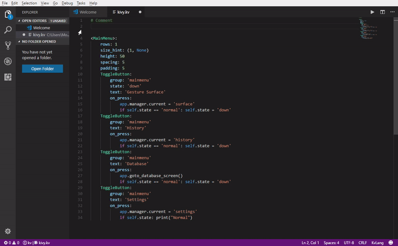
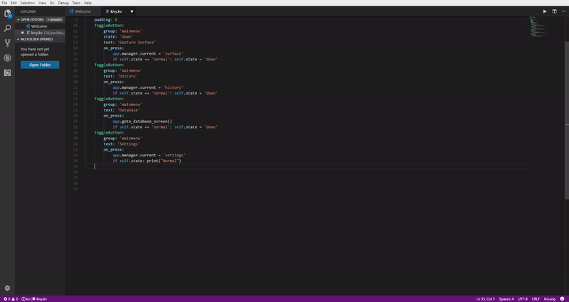
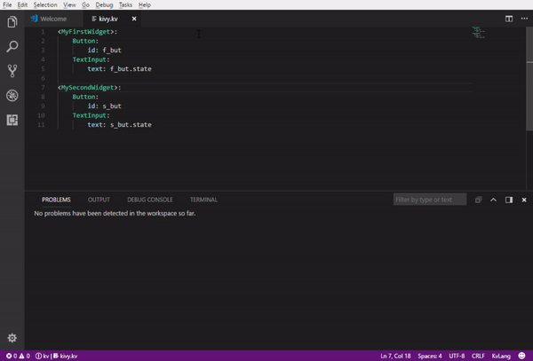

# kvlang README

A Visual Studio Code extension with small support for the KvLang language of Kivy: Cross-platform Python Framework for NUI Development

- Key words highlighting
- Kivy language snippets
- Basic snippets of the uix widget inside class rule
- Linter syntax parser with error detection using language server for KvLang

## Quick Start

- Install the extension
- Install Python
- Install Kivy

## Requirements

- Visual Studio Code 1.26.0 or newer
- Python 3.x or 2.7 for the language server
- Kivy open source Python library
- In Windows Python must be added to the system PATH or path to Python provided
- Server run with default Python path: "python". Value can be changed in settings kvlang.pythonPath

## Testing was performed in

- Windows 10 with Python 3.7.0
- Ubuntu 18.10 with Python 2.7.15

## TODO

- Add code formating
- Add IntelliSense support
- Improve Kvlang Language Server

## Known Issues

- Language server is implemented in Python. Lack of it will cause problems
  with extension
- Kivy module is also mandatory. Without this module server will never start
